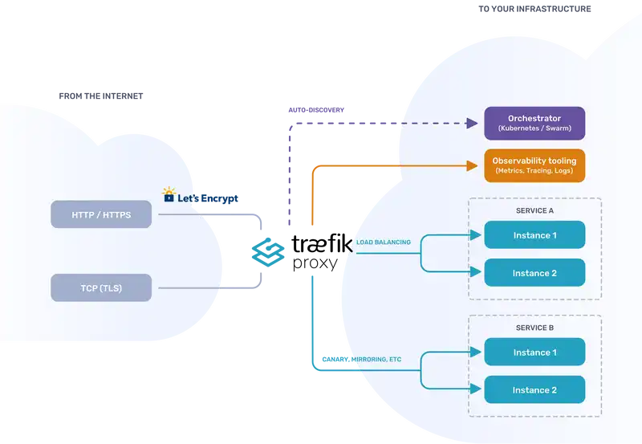
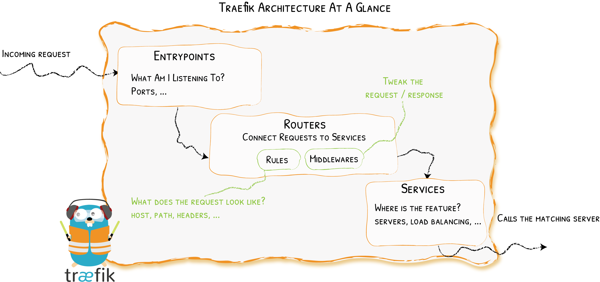
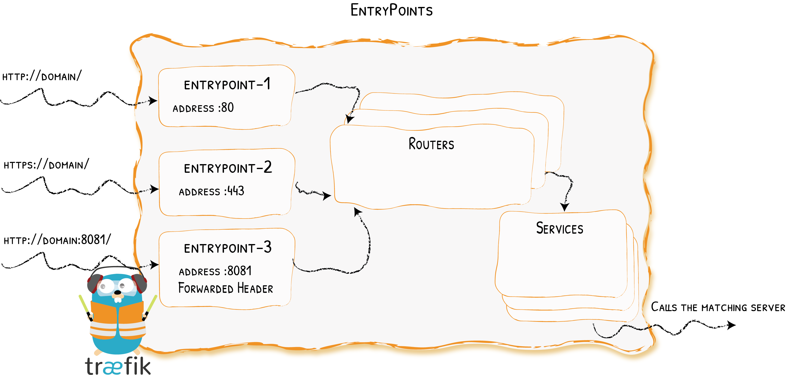

# THEM WEBS VPS

Single VPS deployment using [Traefik](https://traefik.io/traefik/).

How I host [WWW.THEMWEBS.ME](https://www.themwebs.me/) with Traefik and Docker on a single VPS and Cloudflare DNS.



photo: https://traefik.io/traefik/



photo: https://traefik.io/traefik/



photo: https://traefik.io/traefik/

## Github Action

.github/workflows/deploy.yml

The repo is `rsync'ed` to the server using a Github Action.
Follow this [guide on Zellwk blog](https://zellwk.com/blog/github-actions-deploy) to understand how it works.

## Dev setup

- Install [Docker](https://docs.docker.com/get-docker/)
- Install [Docker Compose](https://docs.docker.com/compose/install/)

- Each service is a docker container with its own `Dockerfile`. The `docker-compose.yml` file is used to orchestrate the containers from the root of the project. You can host any kind of codebase with this.
- `home` folder is the homepage. for this VPS. Host your homepage in the `home` folder.
- Traefik will route the traffic to the correct container based on the domain name / sub domain name.
- Traefik will also automatically generate SSL certificates using [Let's Encrypt](https://letsencrypt.org/).
- Traefik will give you a monitoring dashboard at `https://monitor.yourdomain.com` this is configured in `traefik_dynamic.toml` file.

Run `docker compose up -d` in project root for the first time. This will create the network and all the containers.

## Add a new service

- Create a new folder in the root of the project. Add a `Dockerfile` to this new folder.
- Update the `docker-compose.yml` with its configs, should be similar to the one in the `home` folder and home configs.
- Google NodeJS Docker(insert favourite stack jargon) to find a nice example of NodeJS Dockerfile to build from.
  
  ```dockerfile
  FROM nginx:alpine
  COPY . /usr/share/nginx/html
  ```
  
- that example will build a basic nginx container with the contents of the current folder and server a static website.
- Push to github and the Github Action will deploy the new service to the server.

log onto server and run `docker compose up -d --build` to start the new service. (this part can also be automated with some bash script 🥸)

## Run Traefik

Traefik itself is also a docker container. It needs access to the docker socket to be able to listen to events and update its configuration.

for testing purpose only you can quickly run this command to see how it works. Generally always the docker compose  file will take care of this.

```bash
docker run -d \
  -v /var/run/docker.sock:/var/run/docker.sock \
  -v $PWD/traefik.toml:/traefik.toml \
  -v $PWD/traefik_dynamic.toml:/traefik_dynamic.toml \
  -v $PWD/acme.json:/acme.json \
  -p 80:80 \
  -p 443:443 \
  --network web \
  --name traefik \
  traefik:latest
```

## Cloudflare DNP API (Optional)

I use cloudflare as my DNS provider. To be able to update the DNS records I need to create an API token. But you can use any DNS provider

<https://dash.cloudflare.com/profile/api-tokens?ref=blog.cloudflare.com>

<https://developers.cloudflare.com/fundamentals/api/get-started/create-token/>

```bash
curl -X GET "https://api.cloudflare.com/client/v4/user/tokens/verify" \
     -H "Authorization: Bearer CF_DNS_API_TOKEN" \
     -H "Content-Type:application/json"
```
